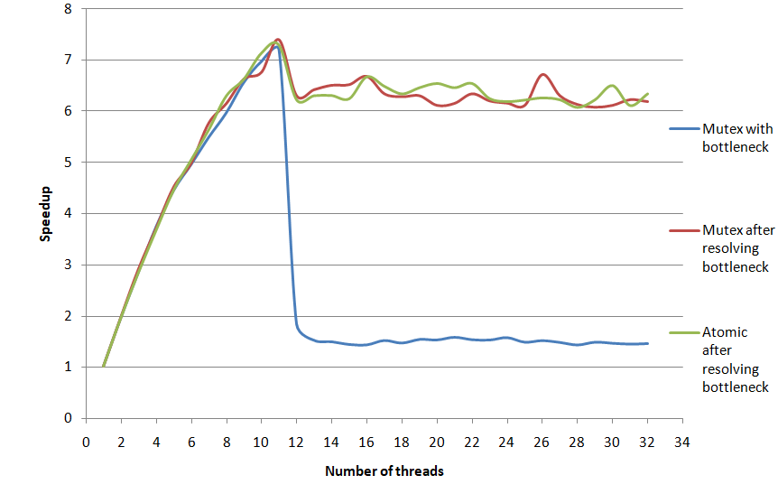
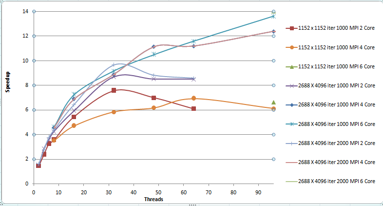

# There are 3 projects in this repository 
1) synchronization with mutexes and atomics 
2) OpenMP with calculatihg the heat
3) MPI with calculating the heat
#  1 Its a simple c++ project in which synchronization with mutexes and atomics was needed
The idea was to create a producer and up to 32 workers with 1 queue.
The producer is asynchronous and it produces the records to queue. At the same time workers should get values from this queue.

In a1 - parallel-atomic synchronization atomics were used to write to variables.
In a1 - parallel - mutexes mutexes were used everywhere

##To compile run :
    g++ -O2 -lpthread -std=c++20 -o  m1 .\a1-parallel-mutex.cpp
    g++ -O2 -lpthread -std=c++20 -o  m1 .\a1-parallel-atomic.cpp
    
    C ++ 20 required

The program will use number of threads which hardware_concurrency function will return, yet its possible to change that.

The main objective of the program was resolving the bootleneck which exist when there is too much of the synchronization:

As its shown above the maximum speed up was obtained for 12 threads and equals ~7. It is possible to use compare_exchange_strong methods to get  speedup of
~ 11.

# 2 - 3 projects are about  heat equation 
## Project 2 was about parallelizng the loops using OpenMP
## Project 3 was about using MPI to create local matrixes with halo reginons and communicate with point to point communication matrixes between processes

# Results

