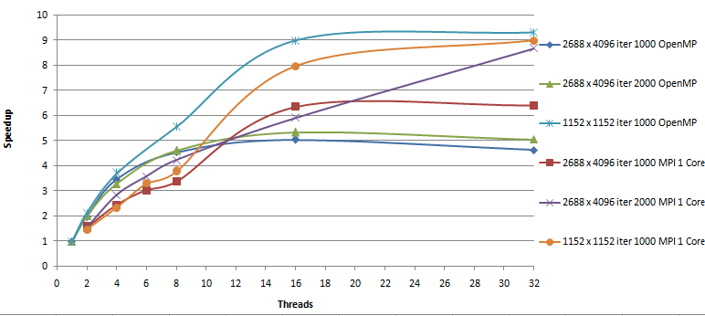

# There are 3 projects in this repository 
1) synchronized queue  using  mutexes and atomics (2 approaches) C ++ 20, unique_locks and cond_variables used 
2) OpenMP - calculatihg the heat project
3) MPI - calculating the heat project
#  1 Its a  c++ project in which synchronized queue was created using 2 approaches -  mutexes and atomics 
The idea was to create an asynchronized producer, which distributed for up to 32 workers (the queue was used for synchronization).
The producer is asynchronous and it produces the records to queue. At the same time workers should get values from this queue.

In a1 - parallel-atomic synchronization atomics were used to write to variables.
In a1 - parallel - mutexes mutexes were used everywhere

##To compile run :
    g++ -O2 -lpthread -std=c++20 -o  m1 .\a1-parallel-mutex.cpp
    g++ -O2 -lpthread -std=c++20 -o  m1 .\a1-parallel-atomic.cpp
    
    C ++ 20 required

The program will use number of threads which hardware_concurrency function will return, yet its possible to change that.

The main objective of the program was resolving the bootleneck, which exist when there is too much of the synchronization:

As its shown above the maximum speed up was obtained for 12 threads and equals ~7. It is possible to use compare_exchange_strong methods to get  speedup of
~ 11.

# 2 - 3 projects are about  heat equation 
## Project 2 was about parallelizng the loops using OpenMP
## Project 3 was about using MPI to create local matrixes with halo reginons and communicate with point to point communication matrixes between processes

# Results

